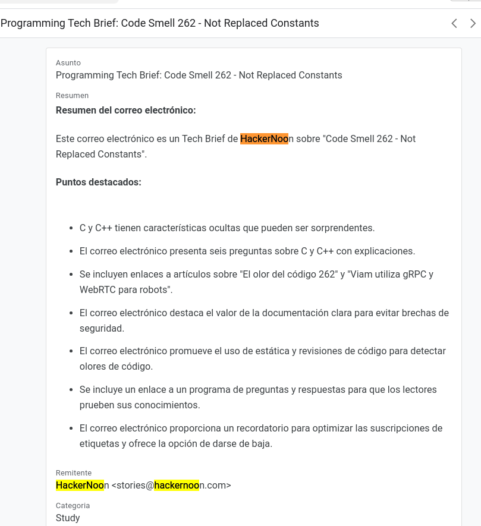
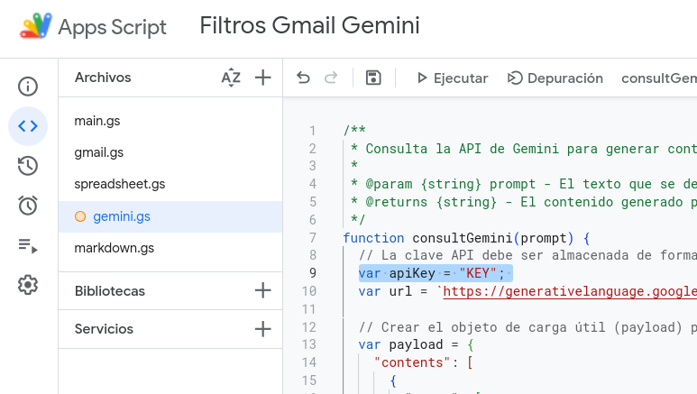
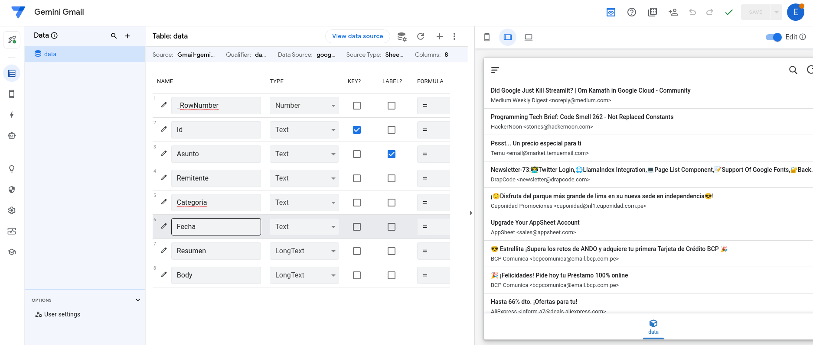

# Gmail-Gemini
Transforms the ways you read emails with Gemini

## Example
* Original email

* With Gemini Gmail

The application uses Gemini API to transform the way you manage your emails. With it, you can generate automated summaries and organize emails in specific categories, such as work, finance, and personal, all with an approach to flexibility and ease.

The objective of this application is not only to reduce daily workload, but also ensure that no important email is lost among digital noise.

With Gmail Gemini, now managing your inbox becomes a quick and efficient task, enhancing your productivity and freeing time for what really matters.

## Build
1. Move the **"./src"** folder files to an environment in **Scripts Apps**
2. Configure your **Gemini** token in "gemini.gs"

3. Configure a **trigger** pointing to the Main function in **App scripts**
    * By default in your drive an Spreadsheet file will be created with the name **"Gmail-Gemini"**

4. Choose a personalized view in Appsheet
    * I did not find a way of being able to export or share my APP SHEET configuration without exposing my data 😦
